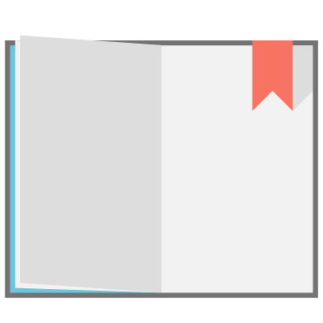
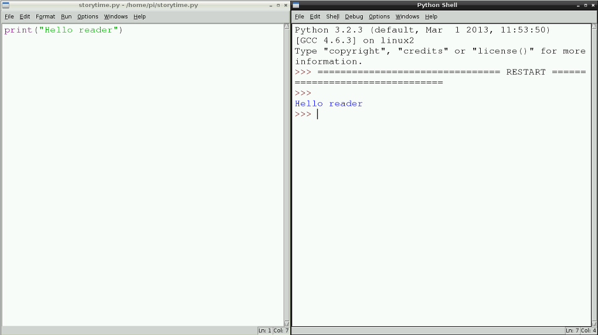

# Story Time with Python



This tutorial allows you to tell a story with code. It demonstrates the simple use of if/else statements to evaluate user input that generates a cute fairy story. This is a fun way to get started with Python programming that allows you to really use your imagination and story telling abilities!

## Step 0: Setting up your Raspberry Pi

You will need to set up your Raspberry Pi to take part in this activity. See the Raspberry Pi Start Guide here to get you up and running.

## Step 1: Using a Text Editor

A great way to write your code and test it in intavals is to use a text editor. You will be writing your code in Python 3, and the Python programming environment **IDLE3** has a text editor that you can use with it. 

1. Load **IDLE3** by either double clicking the dekstop icon, or by click on the **Main Menu**, followed by **Programming** and then selecting **IDLE3**.

2. Once the Python Shell window has loaded click on **File** and **New Window**. This will open a text editor window in which you can write, save and test your code.

3. Save the file as `storytime.py` by clicking on **File** and **Save As**.

## Step 2: Get user input and print to the screen

The purpose of the story time program is to generate a story and print it to the screen so someone can read it. A good way to start therefore is understanding how to use the Python `print` function.

1. In your `storytime.py` file open in a text editor window type the following line:
	
	```python
	print("Hello reader")
	```
	
2. Save the file by clciking on **File** and **Save**. Next run the program to see what happens. To run a program click on **Run** followed by **Run Module**. You should see the words hello reader appear in the Python Shell window. 

	*Note that this tutorial uses Python 3 syntax so you must be using IDLE3 to run your program.*

	

3. Now that you can print to the screen, let's find out some information from the person using the program and store it in a variable. At the top of your code type:

	```python
	name = input('What is your name? ')
	print("Hello " + name)
	```

4. Save the file and run your code to see what happens. Notice that the input question is printed to the screen and then your inputted information is stored in the variable 'name' which is then used in the printed statement saying hello.	 
	
	
5. Can you now create two more variables to store information about what gender the user is, and whay day of the week it is?


## Step 2: If, Elif and Else

Having discovered the gender of the user, you can use that information in your story, but as you know from your literacy lessons, nouns are preceeded with 'he and 'she', and not 'girl' or 'boy' which are the values currently stored in the gender variable. It's okay, as we can use computing concept to help us out. 

1. Underneath the input and print statements type:

	```python
	if gender == "girl":
	    pronoun = "she"
	elif gender == "boy":
	    pronoun = "he"    
	else:
	    pronoun = "it"
	```    
	

## Step 3: Lists

Much of your story that is generated by this program will be random. That's part of the fun. Now you need to create some lists that store different and ammusing words that can be used in your final story program. 

Lists can be named in much the same way as variables. For example, `number = [1, 2, 3, 4]`. This list called 'number' has four items in it. 

1. Underneath the last line of code you have written in your storytime program, leave a line blank and then type:

	```python
	names = ["Alice", "Bob", "Eve", "John", "Jill", "Alan", "Ada", "Grace", "Linus"]
	```
	
	This is a list of different names. You can change the names between the quotation marks and replace them with names of your friends, or made-up names. 
	
2. Create more lists for 'places', 'actions' and 'roles' like this:

	```python
	roles = ["knight", "princess", "prince", "frog", "wizard", "ogre" ]
	```
		
## Step 4: Using Random

With lists of actions, places, names, and roles you can write some code that will randomly pick one item from each list. This will help to generate your story, and should result in a very quirky story!


1. Go to the top of your program, above all the lines of code you have already written. At the top type `import random`. This imports the random module. Modules are...

2. Then go to the bottom of your code and underneath your lists type:

	```python
	actor_name = random.choice(names)
	```
	


## Step 5: Story Time!

Great, you have made it to the fun part. Here is where you get to piece all your hard work togather into a story. Here you can be as imaginative and creative as you like bringing it all together.

1. This part of the program will be written all on one line. Begin by creating a variable to store your story in by typing `story =`

2. Then on the same line open a quotation with `"`

3. Next type the start of your story, for example `Once upon a time, there was a`

4. Leave a space and then close your qoutation marks `"` 

5. Now you can add a random plater role by typing `+ player_role +`

6. Then return to typing your story by opening qoutation marks `" called "`

7. And add the users name ` + name +` before writing more of the story.

8. Continue until you have used all your varaibles like this:

	```python
	story = "Once upon a time, there was a " + player_role + " called " + name + ". " + 	pronoun + " and some friends found themselves in the magic land of " + 	random.choice(places) + ". This land was ruled by " + actor_name + " the " + actor_role + 	". All of a sudden a mysterious voice spoke to them from high in the sky and said you must 	" + quest + " " + actor_name + " the " + actor_role + " to lift the curse of not being 	able to use technology...."
	```
	*Remember this should be typed all on one line!*
	

## Step 6: The final print

There is one last line of code you need to write in order for the final randomly generated story to appear on the screen, and it was the first python code you learned in step 1. The print function!


1. To print your final story type:
	
	```python
	print(story)	
	```
